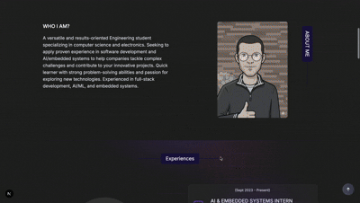

# Portfolio
Passionate and driven Graduate Student currently pursuing a Master of Science in Computer Science and Computer Engineering at ESEO. This profile serves as a repository for my academic work, personal technical projects, and contributions to open source.


# Showing

## Experience



## Skills


## Projects


## Education


# Guide: Running the Project with React (Vite)

This document explains how to run this project—originally structured for **Next.js**—using **React + Vite**.

##  1. Prerequisites

Before starting, ensure you have installed:

* **Node.js** (version 18 or higher recommended)
* **npm**, **yarn**, or **pnpm**

##  2. Project Context

The repository contains files typically used for a **Next.js** application:

* `app/` – Pages and routing
* `public/` – Static assets
* `next.config.js` – Next.js configuration
* `package.json` – Dependencies including Next.js

➡️ To run the project using **Vite**, you will need to **migrate the structure** or set up a separate Vite environment.

##  3. Creating a React + Vite Project

Inside the root folder of the repository, run:

```bash
npm create vite@latest frontend -- --template react
```

Or with pnpm:

```bash
pnpm create vite frontend --template react
```

This generates a `frontend/` folder containing the Vite setup.

##  4. Recommended Structure

A clean structure may look like this:

```
/ (root)
  /frontend     → React + Vite app
  /app          → Original Next.js pages
  /public       → Shared assets (copy needed files to frontend/public)
  other config files...
```

##  5. Migrating Code from Next.js to React

Next.js uses file‑system routing and built‑in server-side features. To use React + Vite, you must adapt the project.

### Migration Steps

1. Copy reusable components from `app/` into `frontend/src/components/`.
2. Convert Next.js pages into standard React components under `frontend/src/`.
3. Replace Next.js routing with **React Router**:

```bash
npm install react-router-dom
```

4. Update or remove imports relying on Next.js‑specific features (e.g., `next/link`, `next/image`).

##  6. Tailwind CSS Setup (if needed)

If your project uses Tailwind CSS:

```bash
cd frontend
npm install -D tailwindcss postcss autoprefixer
npx tailwindcss init -p
```

Then configure `tailwind.config.js` and enable Tailwind in `src/index.css`.

## ▶ 7. Running the Vite App

Once setup is complete:

```bash
cd frontend
npm install
npm run dev
```

The app will run at:

```
http://localhost:3000
```

##  8. Summary

* The repository is originally a Next.js project
* Running it with Vite requires a separate React environment
* Manual migration of components and routes is needed
* Use `npm run dev` from inside the `frontend/` directory
